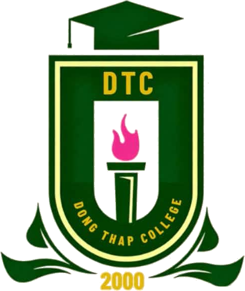

# 📅 Thời Khóa Biểu DTC - Trường CĐ Đồng Tháp

<p align="center">
  
</p>

<p align="center">
  <strong>Ứng dụng tra cứu thời khóa biểu sinh viên Trường Cao đẳng Đồng Tháp</strong><br>
  <em>Lưu hành miễn phí • Tiện lợi • Hỗ trợ xem ngoại tuyến khi mất mạng</em>
</p>

<p align="center">
  
  
  
</p>

---

## 👨‍💻 Thông Tin Tác Giả & Đơn Vị

* **Tác giả phát triển**: **Phan Nguyễn Hữu Nghĩa**
* **Lớp**: **CĐ DVTY K26B**
* **Đơn vị**: **Trường CĐ Đồng Tháp**
* **Thông điệp**: *Ứng dụng được lưu hành miễn phí, giúp cho các bạn sinh viên có thể xem thời khóa biểu một cách dễ dàng, nhanh chóng và tiện lợi mọi lúc mọi nơi.*

---

## ✨ Tính Năng Nổi Bật

- 🔍 **Tra cứu nhanh chóng**: Lọc theo Khoa ➔ Khóa ➔ Lớp và tích hợp thanh tìm kiếm tên lớp thông minh.
- 📆 **Chế độ xem linh hoạt**:
  - **Từng ngày**: Hiển thị chi tiết các tiết học của ngày đã chọn.
  - **Cả tuần**: Hiển thị toàn cảnh lịch học cả tuần từ Thứ 2 đến Chủ nhật.
- ⏳ **Điều hướng tuần thông minh**: Xem tuần trước, tuần sau, chọn tuần bất kỳ hoặc nhảy nhanh về tuần hiện tại.
- 🌓 **Giao diện Hiện đại**: Tự động hỗ trợ cả chế độ **Sáng (Light Mode)** và **Tối (Dark Mode)** dịu mắt.
- 📶 **Hỗ trợ Ngoại tuyến (Offline Mode)**: Dữ liệu được lưu vào bộ nhớ đệm, điện thoại không có mạng hay hết 4G vẫn mở app xem lịch học bình thường.
- ⚡ **Bộ nhớ đệm siêu tốc (In-Memory Cache)**: Tải dữ liệu trong 0.02 giây, không lo server trường bị quá tải khi nhiều sinh viên tra cứu cùng lúc.
- 🎁 **Tính năng ẩn (Easter Egg)**: Chạm liên tục 10 lần vào biểu tượng đổi Sáng/Tối để xem thông tin ứng dụng.

---

## 📱 Các Phiên Bản Ứng Dụng

### 1. Dành cho Android (.apk)
* File cài đặt: `TKB_DTC.apk`
* Dung lượng: Siêu nhẹ chỉ **~1.75 MB** (khi cài vào máy chiếm ~6 - 8 MB).
* Cài đặt: Tải file về điện thoại Android và mở cài đặt trực tiếp.

### 2. Dành cho iOS (iPhone / iPad)
* **Cách 1 (Khuyên dùng - PWA)**: Mở link trên Safari ➔ Bấm nút **Chia sẻ** (Share ⬆️) ➔ Chọn **"Thêm vào Màn hình chính"** (*Add to Home Screen*). Chạy toàn màn hình như app tải từ App Store, dùng vĩnh viễn không bị Apple giới hạn 7 ngày.
* **Cách 2 (File .ipa)**: Sử dụng file `TKB_DTC.ipa` cài qua 3uTools, Sideloadly hoặc TrollStore (hỗ trợ iOS 12.0+ trở lên).

### 3. Phiên bản Web (Online)
* Truy cập trực tiếp qua trình duyệt trên mọi thiết bị máy tính và điện thoại.

---

## 🚀 Hướng Dẫn Cài Đặt & Chạy Cục Bộ (Local)

### Yêu cầu:
* Python 3.8 trở lên

### Các bước thực hiện:
1. Tải hoặc clone mã nguồn:
   ```bash
   git clone https://github.com/<tai-khoan-cua-ban>/tkb-dtc.git
   cd tkb-dtc
   ```

2. Cài đặt các thư viện cần thiết:
   ```bash
   pip install -r requirements.txt
   ```

3. Khởi chạy máy chủ:
   ```bash
   python server.py
   ```

4. Mở trình duyệt và truy cập:
   ```
   http://localhost:5000
   ```

---

## ☁️ Triển Khai Miễn Phí Lên Render.com

1. Đăng ký tài khoản tại [Render.com](https://render.com) (liên kết với GitHub).
2. Chọn **New +** ➔ **Web Service** ➔ Chọn kho GitHub `tkb-dtc`.
3. Cấu hình:
   - **Runtime**: `Python 3`
   - **Build Command**: `pip install -r requirements.txt`
   - **Start Command**: `python server.py`
   - **Plan**: `Free`
4. Bấm **Create Web Service** để nhận đường link sử dụng chính thức.

---

## 📄 Giấy Phép (License)

Dự án được phân phối dưới giấy phép [MIT License](LICENSE).
Mọi người có thể tự do tham khảo, học tập và sử dụng vì mục đích học tập phi thương mại.
